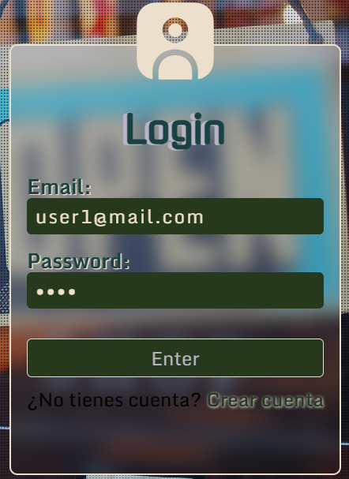
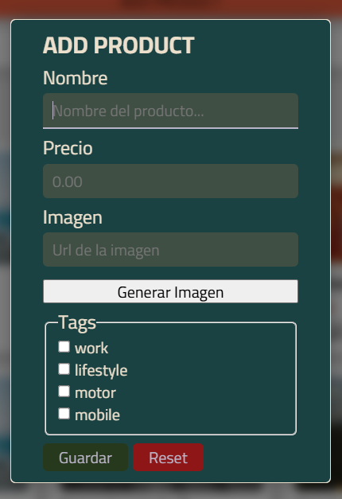
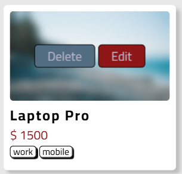

# NodePop

## Installation

Install dependencies with:

 ```sh
 npm install
 ```

 On first deploy you can use the next commando to initialize the database:

 ```sh
 npm run initDB
 ```

> User to login default

 - email: user1@mail.com
- password: 1234

 

> Add a product



 > To delete a product you must do hover on image product

 